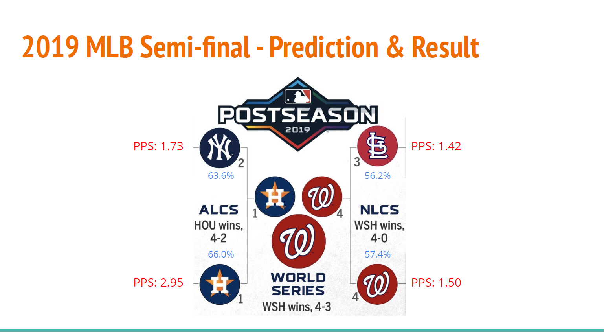
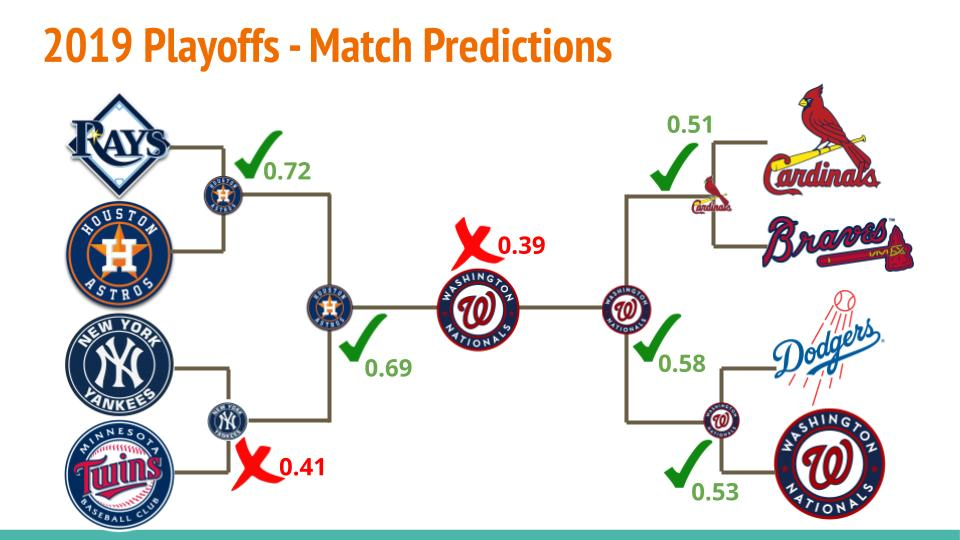

# MLB Playoffs Prediction
A project from my Data Preparation and Analysis class. We gathered MLB regular season team data (which includes number of strike outs, homeruns etc.) from 2001 to 2018 of all teams. The teams stats are then normalized by year so we get the relative performance of each team in its year, then the teams that made playoffs are selected. At first we attempted to create our own index for measuring playoff performance, the Playoff Performance Score (PPS) which we came up with. We used multi variate linear regression in R to fit the parameters to the PPS we assigned but it was not performing very well at predicting quarter final matches where half the teams were dropped out. We can see a graph of predicted PPS values of the MLB 2019 semi-finals and finals below with the actual results.  

  

The largest flaw of our method was that it calculates a team's standing without considering the opposing team. Another method we tried was binary classification of each individual match itself. We used parameters from each of the pair of teams that had a match and map it to the results of the match. We used Lasso for feature selection and tested over several models (logistic regression, LDA). The final logistic regression model was able to predict 5 out of the 7 matches of the 2019 MLB playoffs!  

